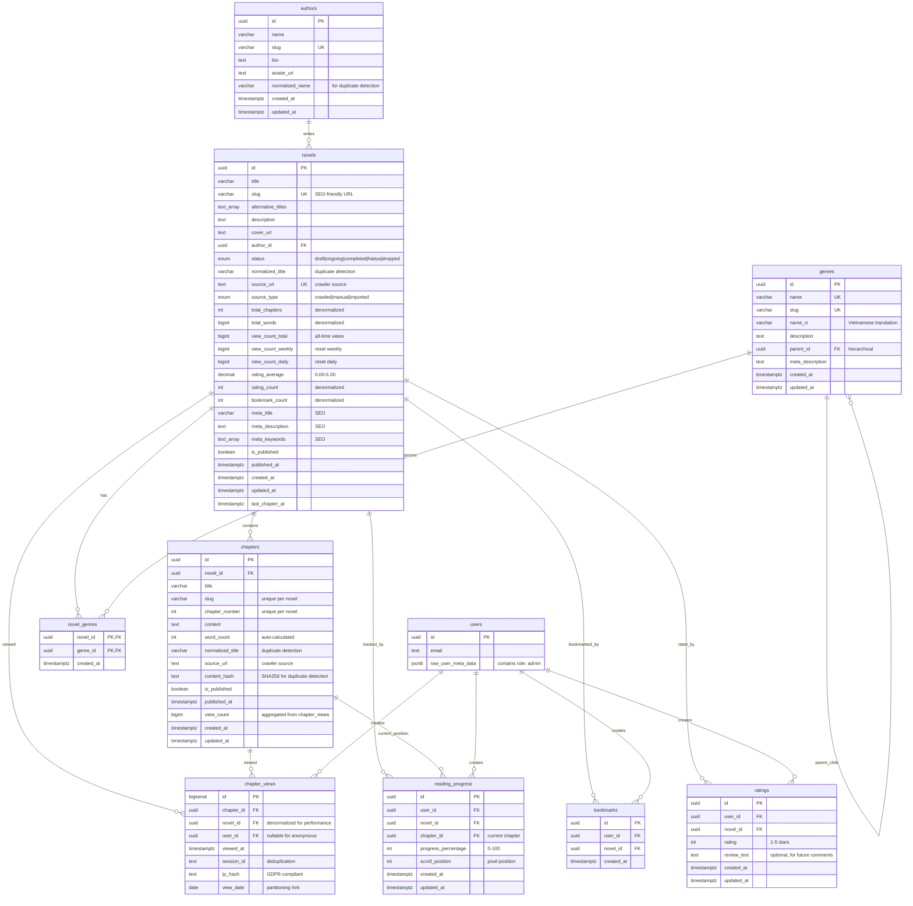

# Entity Relationship Diagram

## Core Content Entities
- **authors** → **novels** (1:N)
- **novels** → **chapters** (1:N)
- **genres** ↔ **novels** (M:N via novel_genres)

## User Interaction Entities
- **users** → **bookmarks** (1:N)
- **users** → **ratings** (1:N)
- **users** → **reading_progress** (1:N)
- **users** → **chapter_views** (1:N)

## Key Relationships

### 1. Hierarchical Genres
```
genres.parent_id → genres.id (self-referencing)
Example: Fantasy → Xuanhuan → Dongxuan
```

### 2. Denormalized View Tracking
```
chapter_views (raw data, high volume)
        ↓ (aggregated periodically)
chapters.view_count
novels.view_count_daily/weekly/total
```

### 3. Auto-updated Aggregates
```
ratings → trigger → novels.rating_average, rating_count
bookmarks → trigger → novels.bookmark_count
chapters → trigger → novels.total_chapters, total_words
```

## Index Strategy

### SEO Routing Indexes
```sql
novels.slug (UNIQUE)
chapters(novel_id, slug) (UNIQUE)
authors.slug (UNIQUE)
genres.slug (UNIQUE)
```

### Trending/Ranking Indexes (Composite)
```sql
novels(view_count_daily DESC, rating_average DESC)
novels(view_count_weekly DESC, rating_average DESC)
novels(view_count_total DESC, rating_average DESC)
novels(rating_average DESC, rating_count DESC)
```

### Anti-Duplicate Indexes
```sql
novels.normalized_title (exact match)
novels.normalized_title gin_trgm_ops (fuzzy match)
novels.source_url (UNIQUE WHERE NOT NULL)
chapters(novel_id, content_hash) (duplicate content)
```

### Performance Indexes
```sql
novels.author_id (author's novels)
novels(is_published, published_at DESC) (latest published)
chapters(novel_id, chapter_number) (chapter list)
chapter_views(chapter_id, viewed_at DESC) (view history)
```

## Security Model (RLS)

### Anonymous Users
- ✅ Read published novels/chapters
- ✅ Insert chapter_views (tracking)
- ❌ No bookmarks/ratings/progress

### Authenticated Users
- ✅ Everything anonymous can do
- ✅ Create/update/delete own bookmarks
- ✅ Create/update/delete own ratings
- ✅ Create/update/delete own reading_progress
- ❌ Cannot modify others' data

### Admin Users
- ✅ Full CRUD on all content tables
- ✅ Read all user interaction data
- ✅ Identified via JWT: raw_user_meta_data->>'role' = 'admin'

## Performance Characteristics

### Fast Operations (< 10ms)
- Novel/chapter lookup by slug
- User's bookmarks list
- User's reading progress
- Trending novels (using composite indexes)

### Batched Operations (runs periodically)
- View count aggregation (every 10-15 min)
- Rating average updates (on change via trigger)
- Materialized view refresh (every 15-30 min)

### Maintenance Operations (scheduled)
- Daily view count reset (daily at 00:00)
- Weekly view count reset (Monday 00:00)
- Old view cleanup (daily at 02:00)
